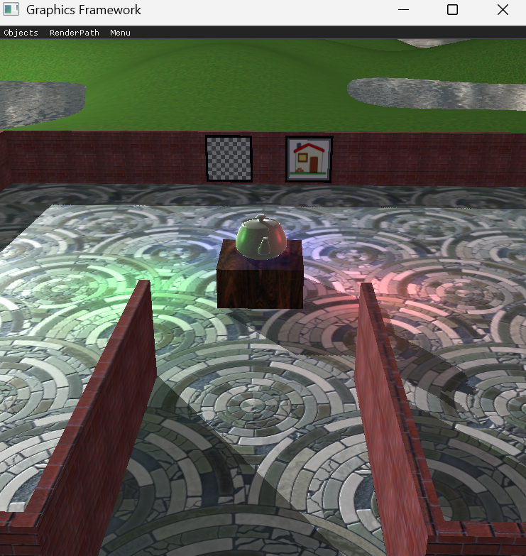
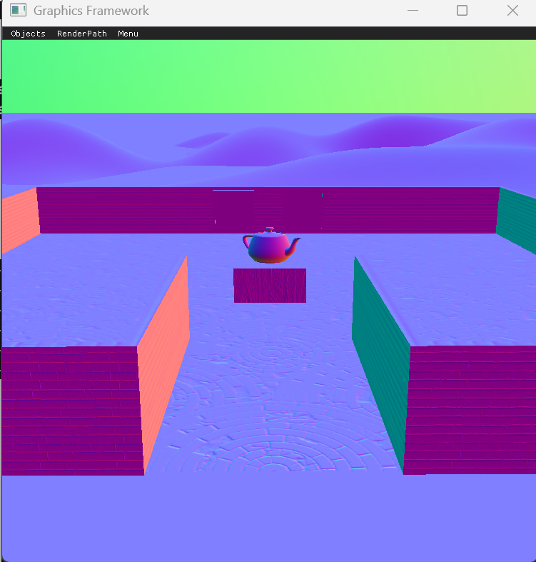
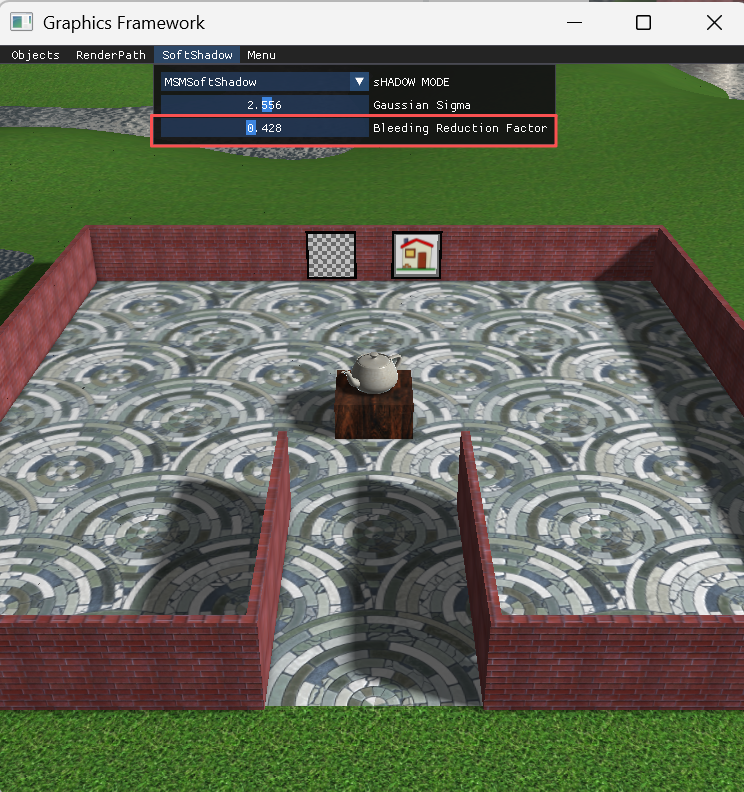
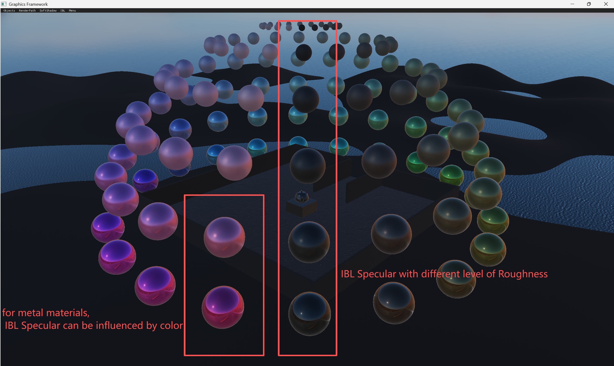
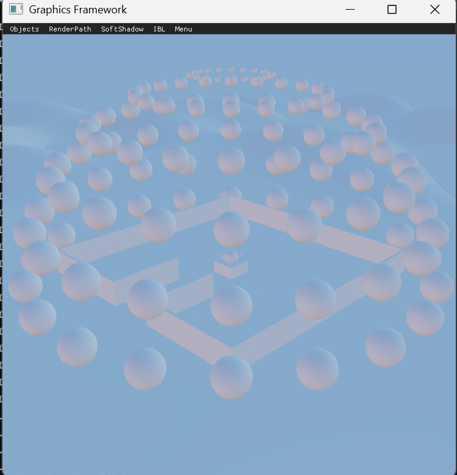
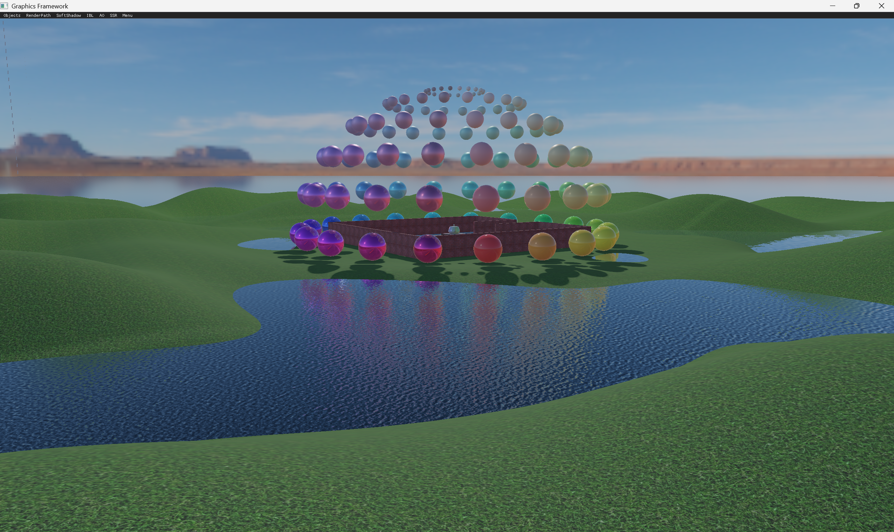

# Portfolio Catalog

## C# code sample
- [PathFind algorithm sample（A-Star algorithm）](C%23%20code%20sample/PathFind%20algorithm%20sample)
  - [CharacterPathFind.cs](C%23%20code%20sample/PathFind%20algorithm%20sample/CharacterPathFind.cs)
- [Unity Editor tool sample](C%23%20code%20sample/Unity%20Editor%20tool%20sample)
  - [BlockData.cs](C%23%20code%20sample/Unity%20Editor%20tool%20sample/BlockData.cs)
  - [LevelGenerator_WaveFunctionCollapseAlgorithm.cs](C%23%20code%20sample/Unity%20Editor%20tool%20sample/LevelGenerator_WaveFunctionCollapseAlgorithm.cs)
  - 

## C++ code sample
- [text game requirement document.txt](C++%20code%20sample/console%20game%20requirement%20document.txt)
- [TurnBasedTextGame.cpp](C++%20code%20sample/TurnBasedConsoleGame.cpp)
- [ObjectAllocator.cpp(a highly-effective Tool based on link list, used to allocate and deallocate fixed-sized memory blocks, it can replace **new** or **delete** function in C++)](C++%20code%20sample/ObjectAllocator/ObjectAllocator.cpp)

## game sample
- [**Rass**（made with C++ custom 2D engine）](game%20sample/Rass)
  - [Download Link(PC)](https://a.unity.cn/client_api/v1/buckets/24b1eaa0-ff82-4c2e-8cb8-34692c4d352c/content/Rass_Setup.zip)
  - [Trailer Video](https://a.unity.cn/client_api/v1/buckets/24b1eaa0-ff82-4c2e-8cb8-34692c4d352c/content/RASS.mp4)
  - [Introduction](game%20sample/Rass/readme.md)
  - [Technical Design Document](game%20sample/Rass/TechnicalDesignDocument.md)
    - 
- [**Delicacy of Dungeon**](game%20sample/Delicacy%20of%20Dungeon)
  - [Download Link(PC)](https://a.unity.cn/client_api/v1/buckets/24b1eaa0-ff82-4c2e-8cb8-34692c4d352c/content/DOD.zip)
  - [Trailer Video](https://a.unity.cn/client_api/v1/buckets/24b1eaa0-ff82-4c2e-8cb8-34692c4d352c/content/DODvideo.mp4)
  - [Introduction](game%20sample/Delicacy%20of%20Dungeon/readme.md)
    - 
- [**Paraland**(WebGL mobile game)](game%20sample/Paraland(WebGL%20mobile%20game))
  - [Source Code Git Link](https://github.com/huboyuan2/Paraland-source-code.git)
  - [WebGL Demo Link（Playable in the browser）](https://huboyuan2.github.io/paralanddemo/)
  - [Trailer Video](https://a.unity.cn/client_api/v1/buckets/24b1eaa0-ff82-4c2e-8cb8-34692c4d352c/content/paraland.mp4)
  - [Introduction](game%20sample/Paraland(WebGL%20mobile%20game)/README.md)
    - /Movie_002.gif)

## C++ OpenGL Realtime Rendering sample

Deferred Rendering (images  shows point lights and g-buffer normal)

dynamic perfect reflection capture(based on dual-parabolic map)

Soft Shadow(based on Moment Shadow Map)

Physically Based Rendering(based on BRDF+GGX, IBL specular, Spherical Harmonic Lighting)

Alchemy Ambient Occolusion

Screen Space Reflection

## Houdini sample

- [Houdini terrain](houdini%20sample)
  - 

## shader sample
- [node based shader graph(height fog effect)](shadersample/node%20based%20shader%20graph)
  - 
- [shader code(Kajia-Kay anisotropic highlight effect)](shadersample/shadercode)
  - 